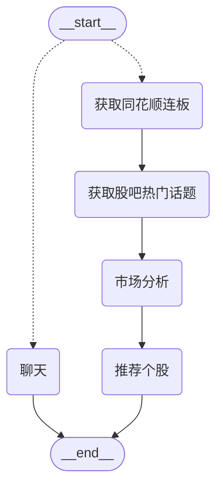

# A股AI大模型交易机器人

这是一个基于OpenAI Swarm的A股大模型交易Agent



## 快速开始

1. 重命名`.env_example`为`.env`并填写必要信息。具体说明如下：
   - `BASE_URL`: 填入兼容OpenAI API的大模型URL
   - `OPENAI_KEY`: 填入兼容OpenAI API格式的模型密钥
   - `MODEL`: 指定要使用的模型名称（例如：gpt-4o）
   - `XUEQIU_PORTFOLIO_CODE`: 雪球组合ID

2. 用浏览器开发者模式复制雪球登录后的cookies字符串并保存到项目根目录cookies.txt

3. 创建并激活虚拟环境：
   ```
   python3 -m venv venv
   source venv/bin/activate
   ```

4. 安装依赖：
   ```
   pip3 install -r requirements.txt
   ```

4. 运行应用：
   ```
   python xueqiu_portfolio.py
   ```

## 功能特点

- 获取同花顺连板和东财股吧话题
- 大模型解读并决定交易标的
- 使用雪球模拟组合进行模拟调仓


## 支持

如果您觉得这个项目有帮助，可以考虑给我买杯咖啡：

[](https://www.paypal.com/paypalme/franklin755)
